# Project Portal – Full Stack Application

A role-based project management system built using modern full-stack technologies. The application supports secure authentication, admin-controlled project management, and a clean, responsive user interface.

---

## Key Highlights

- JWT-based authentication with secure password hashing
- Role-Based Access Control (Admin / Member)
- Admin-only project creation, update, and deletion
- PostgreSQL relational database with TypeORM
- Clean and responsive UI using Tailwind CSS
- Scalable backend architecture using NestJS

---

## Tech Stack

- Frontend: Next.js 14, TypeScript, Tailwind CSS
- Backend: NestJS, TypeORM, PostgreSQL
- Authentication: JWT, Passport.js, bcrypt

---

## Application Access

- Frontend: http://localhost:3001
- Backend API: http://localhost:3000

---

## Permissions

| Role | Create | Update | Delete | View |
|------|--------|--------|--------|------|
| Admin | ✅ | ✅ | ✅ | ✅ |
| Member | ❌ | ❌ | ❌ | ✅ |

---

## Notes

- Frontend enforces role-based UI restrictions
- Backend validates permissions at API level
- Designed with scalability and clean architecture principles

## 📸 Screenshots

### Authentication
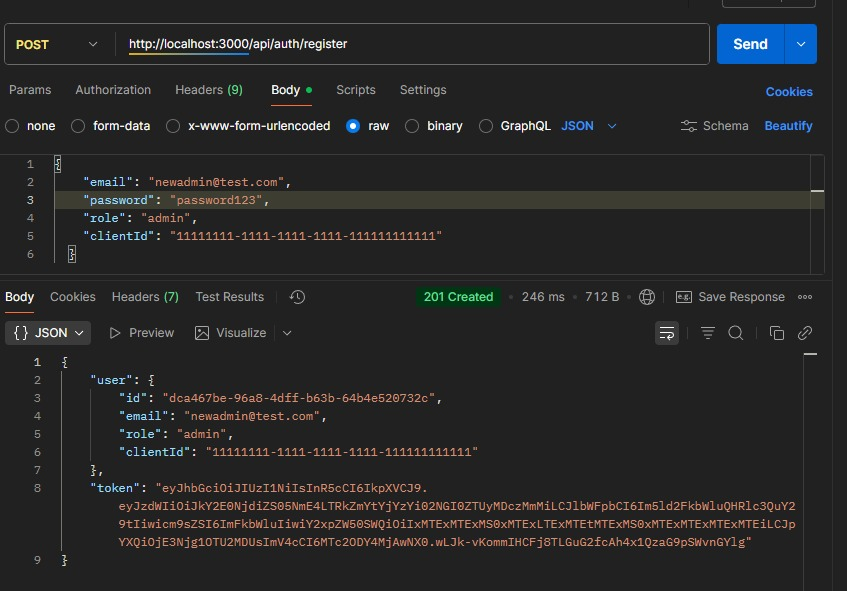
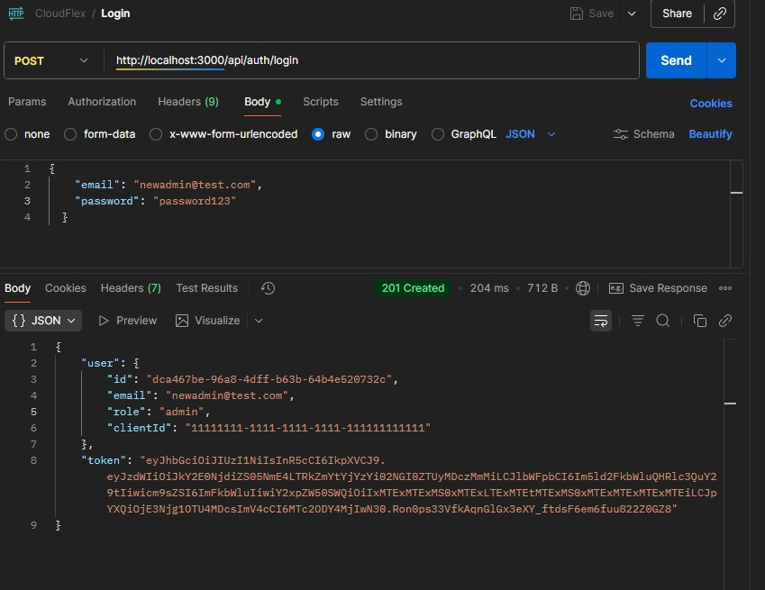
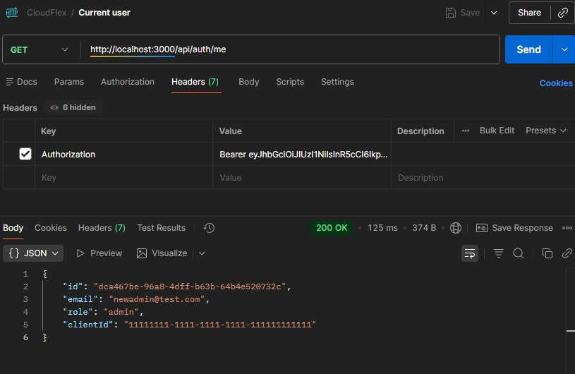

---

### Projects
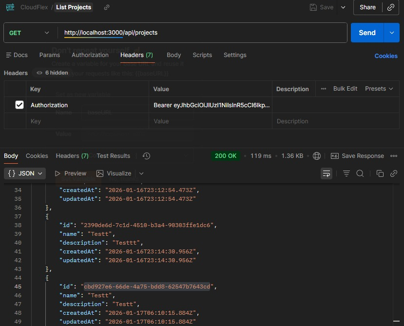
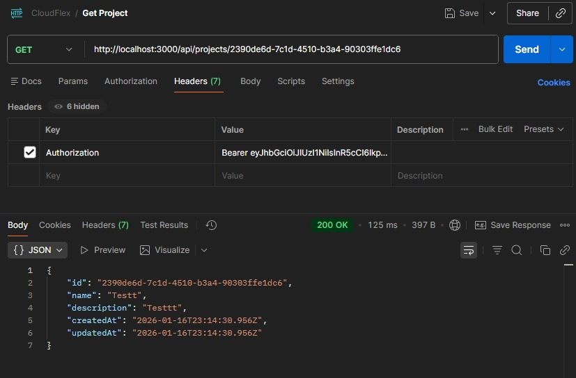
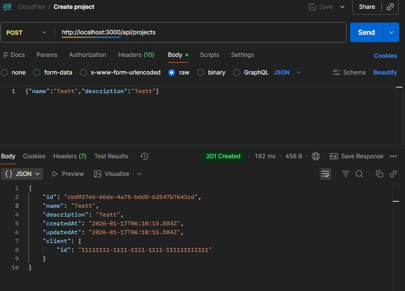
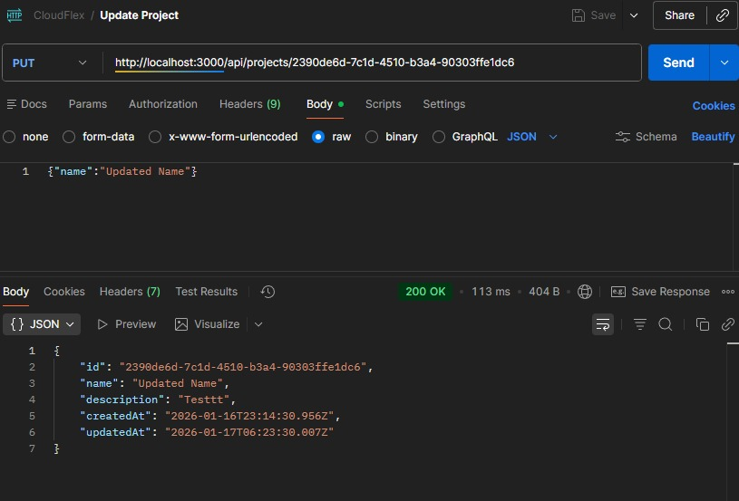
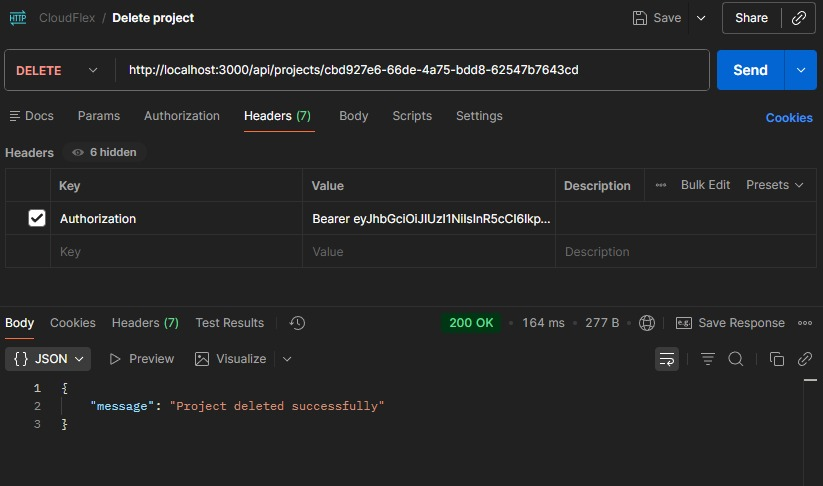

---

### Database Snapshots
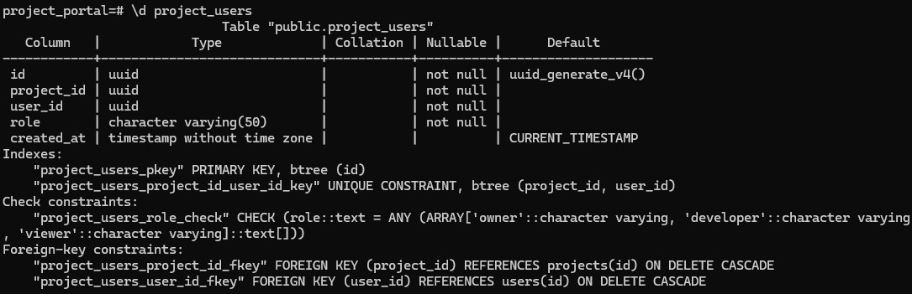
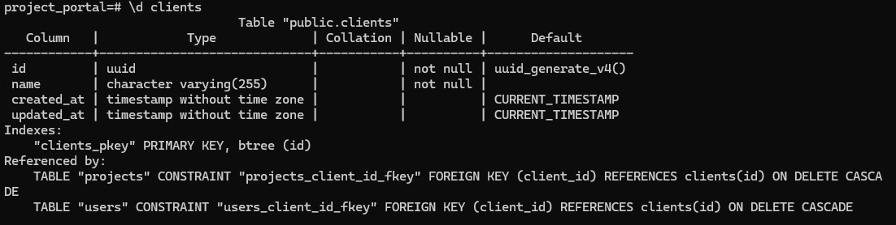
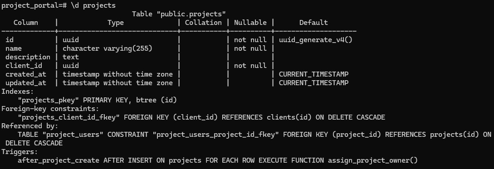
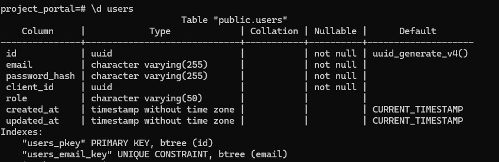
